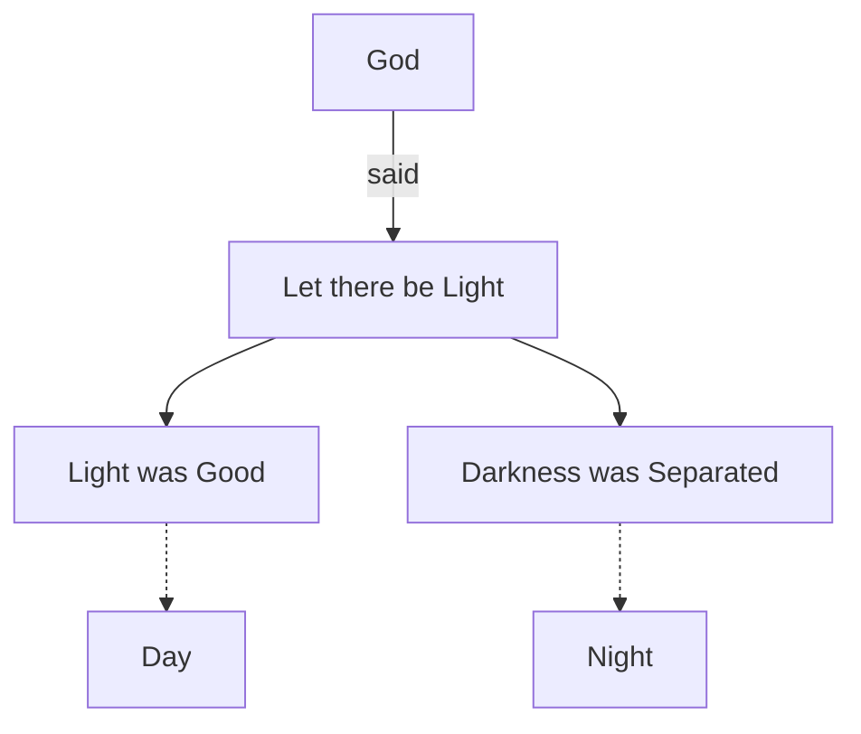

<h1>Light and Darkness</h1>
Day 1 (3-5)

```mermaid

graph TD
  God2["God"] --> |said| Init["Let there be Light"]
  Init --> A["Light was Good"]
  Init --> B["Darkness was Separated"]

  A -.-> Day
  B -.-> Night
```

