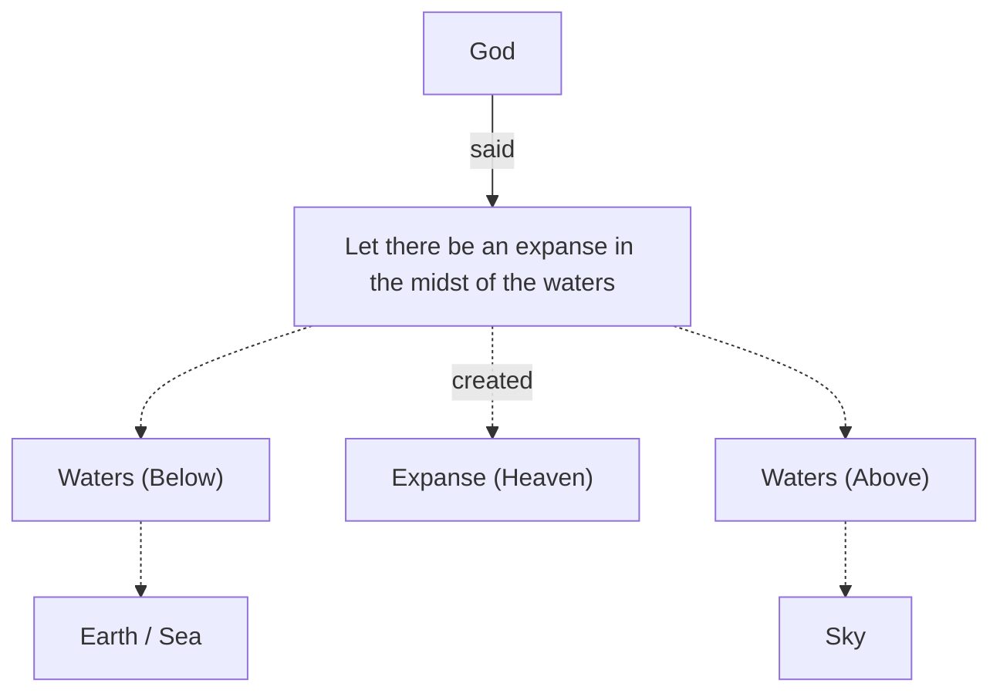

<h1>Expanse</h1>
Day 2

```mermaid

graph TD
  God["God"] --> |said| Init["Let there be an expanse in the midst of the waters"]

  Init -.-> Waters1["Waters (Below)"]
  Init -.-> |created| Expanse["Expanse (Heaven)"]
  Init -.-> Waters2["Waters (Above)"]

  Waters1 -.-> Earth["Earth / Sea"]
  Waters2 -.-> Sky["Sky"]
```

