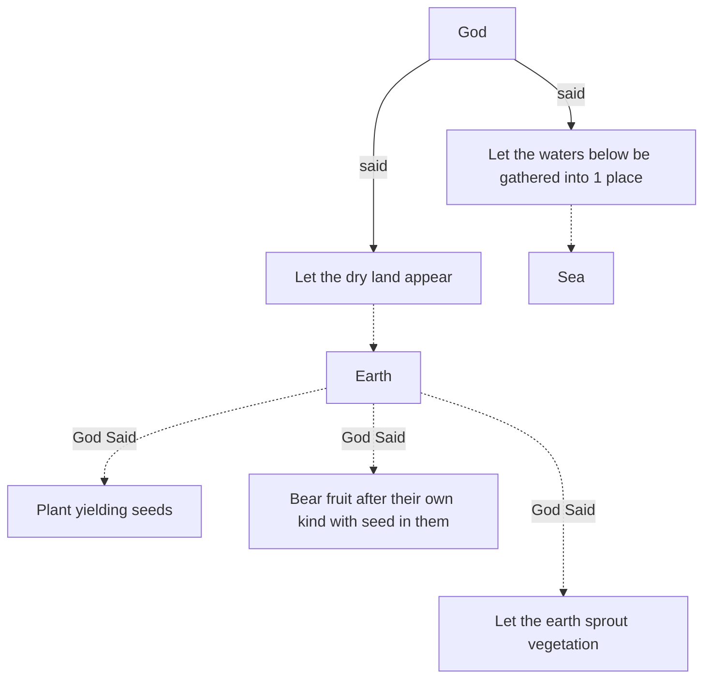

<h1>Earth and Sea</h1>
Day 3

```mermaid

graph TD
  God["God"] --> |said| Init["Let the waters below be gathered into 1 place"]
  God["God"] ---> |said| Init2["Let the dry land appear"]

  Init2 -.-> Earth
  Init -.-> Sea

  Earth -..-> |God Said| Plants1["Let the earth sprout vegetation"]
  Earth -.-> |God Said| Plants2["Plant yielding seeds"]
  Earth -.-> |God Said| Plants3["Bear fruit after their own kind with seed in them"]

```

