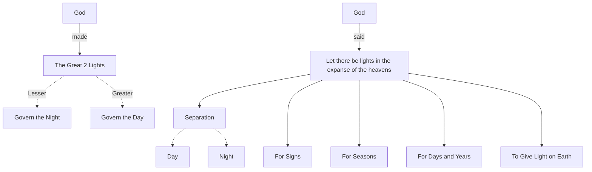

<h1>The 2 Great Lights</h1>
Day 4

```mermaid

graph TD
  God["God"] --> |said| Init["Let there be lights in the expanse of the heavens"]

  Init --> Separation
  Separation -.-> Day["Day"]
  Separation -.-> Night["Night"]

  Init ---> Reason1["For Signs"]
  Init ---> Reason2["For Seasons"]
  Init ---> Reason3["For Days and Years"]
  Init ---> Reason4["To Give Light on Earth"]

  God2["God"] --> |made| TwoLights["The Great 2 Lights"]
  TwoLights -.-> |Lesser| Lesser["Govern the Night"]
  TwoLights -.-> |Greater| Greater["Govern the Day"]
```

