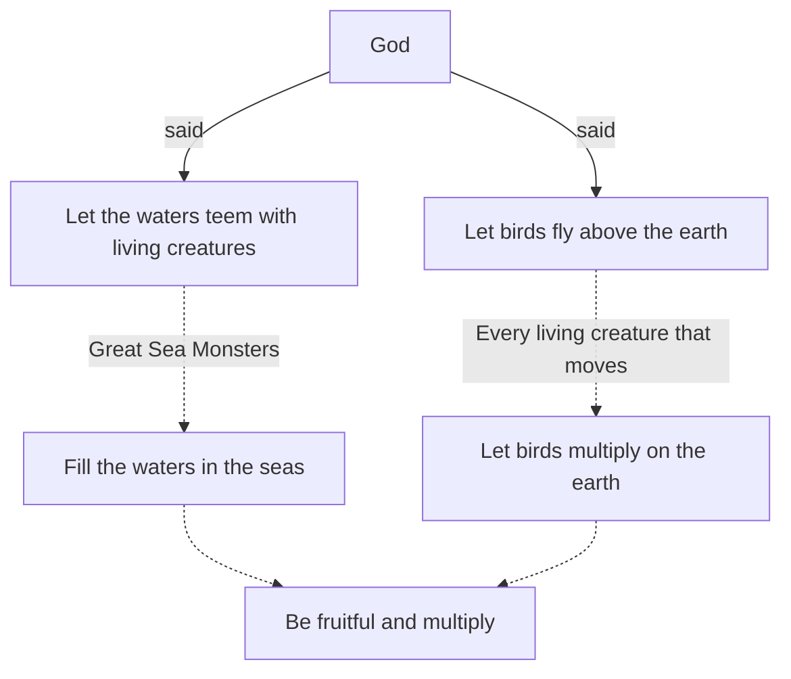

<h1>Birds and Sea Creatures</h1>
Day 5

```mermaid

graph TD
  God["God"] --> |said| Init["Let the waters teem with living creatures"]
  God["God"] --> |said| Init2["Let birds fly above the earth"]

  Init -.-> |Great Sea Monsters| Init4["Fill the waters in the seas"]
  Init2 -.->  |Every living creature that moves| Init5["Let birds multiply on the earth"]

  Init4 -.-> Multiply["Be fruitful and multiply"]
  Init5 -.-> Multiply["Be fruitful and multiply"]

```

