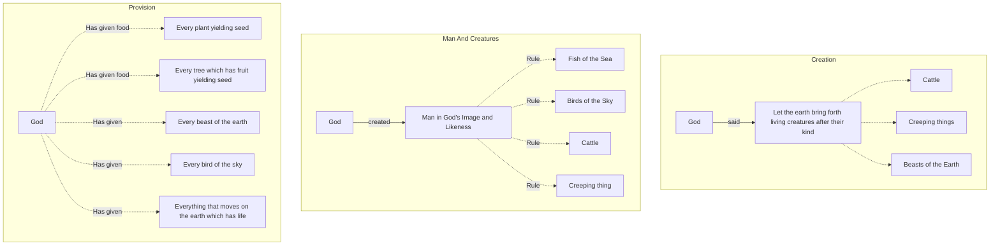

<h1>Man and Creatures of the Earth</h1>
Day 6

```mermaid
graph TD

subgraph Creation
  God["God"] --> |said| Init["Let the earth bring forth living creatures after their kind"]
  Init -.-> Creatures1["Cattle"]
  Init -.-> Creatures2["Creeping things"]
  Init -.-> Creatures3["Beasts of the Earth"]
end

subgraph Man And Creatures
  God2["God"] --> |created| Man["Man in God's Image and Likeness"]

  Man -.-> |Rule| Fish["Fish of the Sea"]
  Man -.-> |Rule| Birds["Birds of the Sky"]
  Man-.-> |Rule| Cattle2["Cattle"]
  Man -.-> |Rule| Creeping["Creeping thing"]
end

subgraph Provision
  God3["God"] -..-> |Has given food| Plant["Every plant yielding seed"]
  God3["God"] -..-> |Has given food| Tree["Every tree which has fruit yielding seed"]
  God3["God"] -..-> |Has given| Beast["Every beast of the earth"]
  God3["God"] -..-> |Has given| Bird["Every bird of the sky"]
  God3["God"] -..-> |Has given| Thing["Everything that moves on the earth which has life"]
end
```

