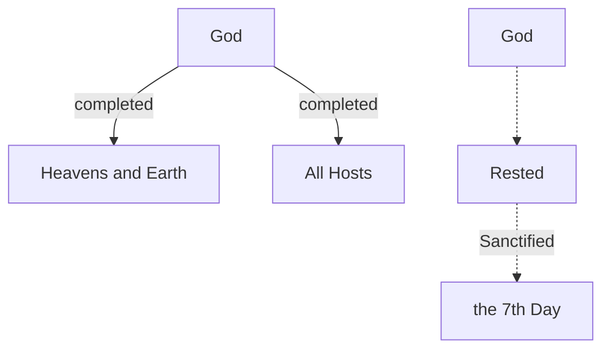

<h1>Rest</h1>
Day 7

```mermaid
  graph TD

  God --> |completed| Completion1["Heavens and Earth"]
  God --> |completed| Completion2["All Hosts"]

  God2["God"] -.-> Rested
  Rested -.-> |Sanctified| Sanctify["the 7th Day"]
```

